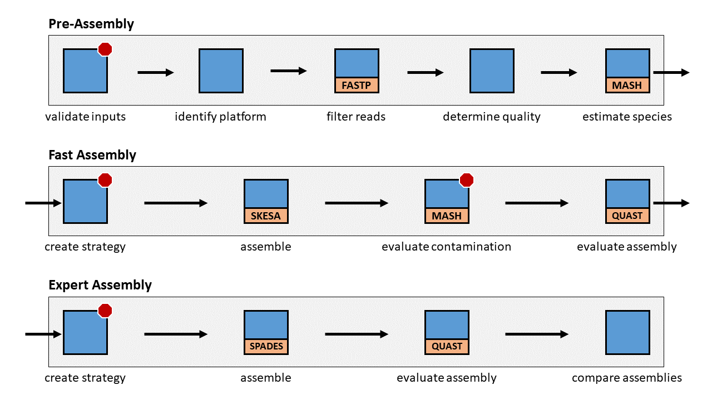

# Assemble

v1.0.0
2021-02-04

The assemble command is responsible for assembling sequencing reads into contigs. It uses an expert system to guide decision-making through the various stages of assembly.

## Pipeline

The assemble pipeline consists of three major stages:

- **Stage 1: Pre-Assembly**: Attempts to estimate information about the reads and prepares the reads for sequence assembly.
- **Stage 2: Fast Assembly**: Assembles the reads hastily in order to derive more information for expert assembly.
- **Stage 3: Expert Assembly**: Assembles the reads in an expert manner using information gathered during the previous stages.

## Pre-Assembly

The pre-assembly stage is responsible for estimating information about the reads, including the species and sequencing technology, and preparing the reads for sequence assembly.

### Validate Inputs

The forward and reverse read inputs are validated in order to ensure that they are in valid FASTQ format. The pipeline will terminate if the inputs appear to be formatted incorrectly.

### Identify Sequencing Platform

The sequencing platform is estimated by looking at the encoding of the FASTQ input reads. If there is not enough information to estimate the sequencing platform, then the platform will be unidentifiable, but assembly will continue. This stage is skipped if the user provides the sequencing platform as a command-line argument.

### Filter Reads

The reads are filtered in order to remove low-quality sequencing content and improve the assembly. FASTP is used to filter the reads.

### Determine Read Quality

The read quality is determined from the filtered reads by parsing the output of FASTP in the previous step. Since FASTP provides some quality metrics of the reads after filtering, this information is parsed into the pipeline and used in later steps.

### Estimate Species

Attempts to estimate the species using MASH. Since MASH is not designed to be a classifier, we shouldn't say that the species is *classified*, but rather the species is *estimated* from  *k*-mer information in the reads. MASH output can be messy on real-world data and will often report multiple species present in the data. High thresholds are therefore used in order to only report species that are very likely to be present. As a consequence of this approach, we cannot confidently make claims about low levels of contamination in the reads and thus ignore contamination.

## Fast Assembly

The fast assembly stage assembles the reads hastily in order to gather some approximate structural information that can be seen after assembling reads into contigs. It should provide the pipeline with more accurate information about which major species are present, approximately how large the assembly will be, and if there is any major contamination present.

### Create Strategy

Creates a fast assembly strategy for assembly using the information gathered during the pre-assembly stage. The sequencing platform, estimated species, and read quality are provided to the expert system, which creates a fast assembly strategy using this information.

It is possible that the expert system will decide that the best course of action is to terminate the pipeline because the provided information suggests no good assemble can be produced. This might happen if the read quality after filtering remains too low, or if there are too many major species present in the reads, suggesting major contamination.

### Assemble

Assembles the reads by executing the fast assembly strategy. Currently, this will always involve using SKESA. However, it is possible to expand this in the future.

### Evaluate Contamination

Evaluates possible contamination in the assembled reads. This is achieved using MASH to ensure that the five largest assembled contigs are estimated to have the same major species as the initial pipeline species estimation. This will not identify minor or medium levels of contamination, but should identify major levels of species contamination in the contigs.

The pipeline will terminate if there is a disagreement in the species estimations.

### Evaluate Assembly

Evaluates the assembly using QUAST. The pipeline uses a non-reference-based QUAST analysis, because of the difficulty of selecting a reference correctly and needing to maintain either a database of references or the ability to download references on the fly. Several assembly metrics are collected, including N50, number of contigs, L50, and total assembly size.

## Expert Assembly

The expert assembly stage consists of the following parts:

### Create Stategy

### Assemble

### Evaluate Assembly

### Compare Assemblies
